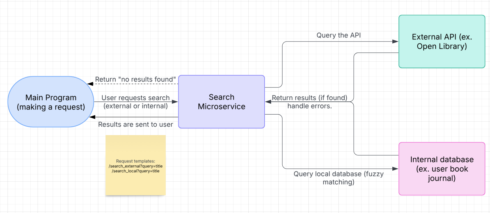

# Search Microservice

## Author: Abigail Yahn
A FastAPI-based microservice for searching external APIs (e.g., Open Library) and local data sources (e.g., book journal, inventory, store items) using fuzzy matching.

## Features
- Searches external sources such as Open Library for books.
- Searches local user data such as inventory or store items via an API.
- Uses fuzzy matching (`rapidfuzz`) to handle typos and partial matches.
- Follows microservice architecture by communicating over HTTP APIs.
- Supports query parameters to customize search source, limit, and accuracy.

## Getting Started

### Prerequisites
Ensure you have the following installed:

- Python 3.9 or higher
- FastAPI (`pip install fastapi`)
- Uvicorn (`pip install uvicorn`)
- Requests (`pip install requests`)
- RapidFuzz (`pip install rapidfuzz`)

### Installation
Clone the repository and install dependencies:
```sh
git clone https://github.com/yahna8/search-microservice.git
cd search-microservice
pip install -r requirements.txt
```

### Running the Microservice
Start the FastAPI microservice:
```sh
uvicorn search:app --host 0.0.0.0 --port 8000 --reload
```
Once running, the API will be available at:
```sh
http://127.0.0.1:8000
```

## API Endpoints

### Search External API
**Endpoint:**
```sh
GET /search_external
```

**Description:**  
Searches an external API (e.g., Open Library) for books.

**Query Parameters:**

| Parameter   | Type  | Description |
|------------|------|-------------|
| `source`   | `str` | The external source to search (`books`). |
| `query`    | `str` | The search term. |
| `limit`    | `int` | (Optional) Max results to return. Default: `5`. |

**Example Usage (python)**
```python
import requests

SEARCH_SERVICE_URL = "http://127.0.0.1:8000"

endpoint = f"{SEARCH_SERVICE_URL}/search_external"
params = {"source": "books", "query": {query}, "limit": {limit}}

response = requests.get(endpoint, params=params)
response.raise_for_status()
data = response.json()
```

### Search Local Data
**Endpoint:**
```sh
GET /search_local
```

**Description:**  
Searches locally stored data from the main program (e.g., journal, inventory, store items).

**Query Parameters:**

| Parameter   | Type  | Description |
|------------|------|-------------|
| `source`   | `str` | The local data source to search (`library`, `store`). |
| `query`    | `str` | The search term. |
| `fuzz_threshold` | `int` | (Optional) Min similarity (0-100). Default: `80`. |
| `limit`    | `int` | (Optional) Max results to return. Default: `5`. |

**Example Usage (python)**
```python
import requests

SEARCH_SERVICE_URL = "http://127.0.0.1:8000"

endpoint = f"{SEARCH_SERVICE_URL}/search_local"
params = {"query": {query}, "limit": {limit}, "fuzz_threshold": {fuzz_threshold}}

response = requests.get(endpoint, params=params)
response.raise_for_status()
data = response.json()
```

## UML Diagram:


